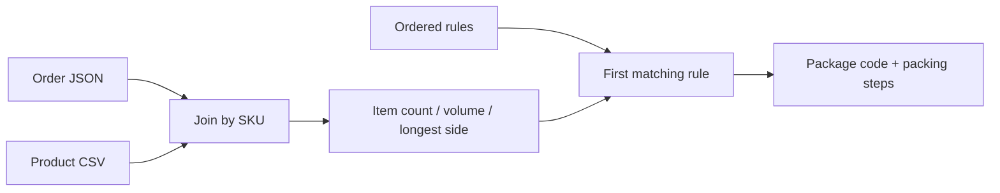

# Shopify Packing Rule Engine

[](https://github.com/mjumair7/shopify-packing-rule-engine/actions/workflows/ci.yml)

A small Node.js rule engine I built around a common fulfillment problem: packaging decisions often live in somebody's head, even when the order and product data already contain enough information to make the decision consistently.

The project reads Shopify-style orders, joins each line to a product-dimension catalog, calculates a few useful facts, and applies the first matching packing rule. It is deliberately a command-line prototype rather than a fake Shopify integration.



## Run it

Node.js 20 or newer is required.

```sh
npm test
npm run analyze -- 1048
npm run analyze -- 1052
npm run analyze -- 1061
```

Example:

```text
ORDER #1048
PACKAGE Mailer M2
Wrap books · Add bookmark · Print label
ITEMS 2 / VOLUME 1188 cm³
```

## Data flow

1. Load order JSON and a product CSV.
2. Join order lines to products by SKU.
3. Validate quantities and dimensions.
4. Calculate item count, total volume, and longest side.
5. Evaluate the ordered rules in `fixtures/packing-rules.json`.
6. Return one package code and a short list of packing steps.

The engine fails closed when a SKU is missing, a quantity is invalid, product dimensions are unusable, or no rule matches. Rule order is intentional: a specific gift or oversize rule should appear before a general fallback.

## Repository map

```text
fixtures/                 sample orders, products, and packing rules
src/data-loader.js        JSON/CSV loading and catalog validation
src/rule-engine.js        fact calculation and ordered rule matching
src/packing-console.js    command-line interface
tests/                    decision and failure-path tests
```

## What this is not

This is not a Shopify app and it does not call the Shopify API. The fixtures stand in for exported data so the decision logic stays easy to run and test. A real integration would add authenticated API ingestion, order-status updates, audit logging, and a review path for orders that match no rule.

## Next steps

- validate the rule file against a schema before processing orders;
- support weight limits and incompatible-item rules;
- return a manual-review result instead of only throwing on unmatched orders;
- add an adapter for real Shopify exports without coupling it to the engine.

MIT licensed.
